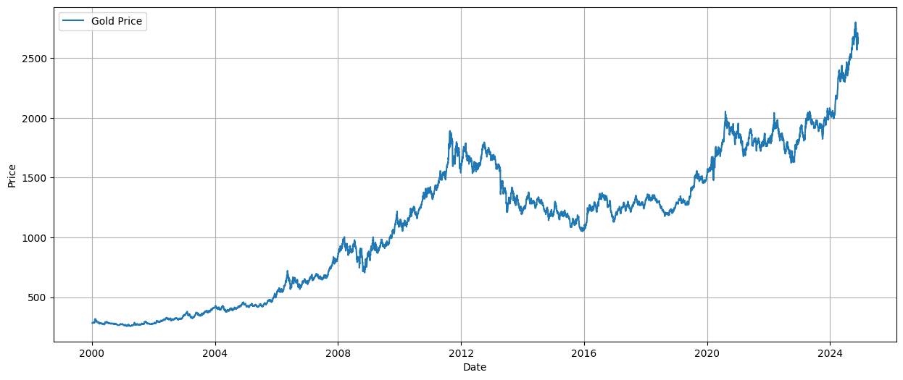
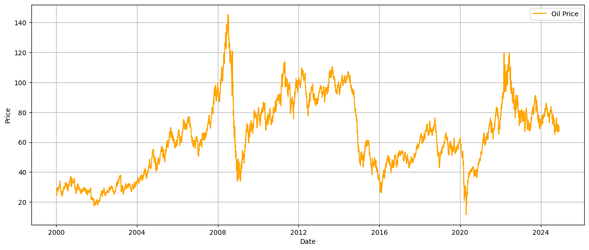
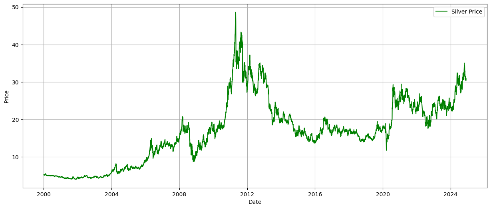

# Gated Recurrent Unit Optimized with Nesterov-Accelerated Adaptive Moment Estimation for Global Gold Price Prediction
## Ismail Harmain, Isran K Hasan

The data used in this study includes global gold price movements, West Texas Intermediate (WTI) crude oil prices, and silver prices. Each dataset was collected on a daily basis from January 1, 2000, to November 30, 2024. All data were sourced from Investing.com.

**Table 1.** The descriptive statistics of the time series
|     | Emas | Minyak | Perak |
| --- | --- | --- | --- |
| Count | 6499.00 | 6499.00 | 6499.00 |
| Mean | 1132.73 | 63.59 | 16.71 |
| Min | 256.60 | 11.57 | 4.03 |
| Max | 2800.80 | 1145.29 | 48.60 |

<table>
<tbody>
<tr>
<td colspan = "2"></td>
</tr>
<tr>
<td colspan = "2" >Gold Price</td>
</tr>
<tr>
<td style="text-align:center"></td>
<td style="text-align:center"></td>
</tr>
<tr>
<td style="text-align:center">Oil Price</td>
<td style="text-align:center">Silver Price</td>
</tr>
</tbody>
</table>

**Figure 1.** Graph of gold prices, oil prices, and silver prices.
