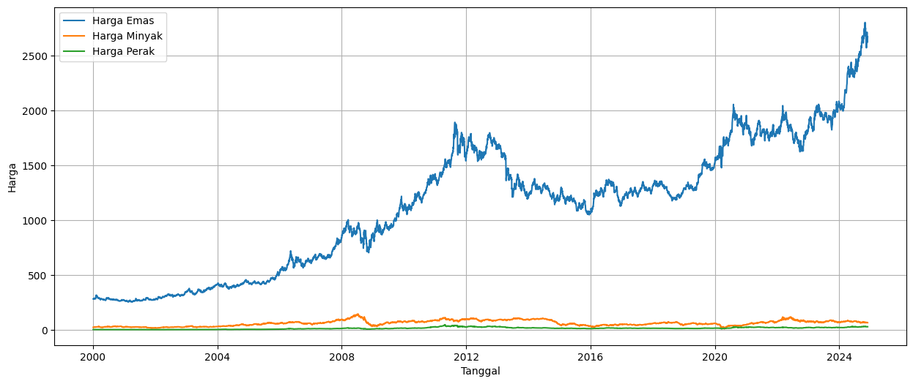

# Gated Recurrent Unit Optimized with Nesterov-Accelerated Adaptive Moment Estimation for Global Gold Price Prediction
## Ismail Harmain, Isran K Hasan
 Emas   Minyak    Perak
         Price    Price    Price
count  6499.00  6499.00  6499.00
mean   1132.73    63.59    16.71
std     585.11    25.26     8.60
min     256.60    11.57     4.03
25%     571.10    43.79     9.77
50%    1224.30    62.44    16.59
75%    1593.40    81.93    22.51
max    2800.80   145.29    48.60
<table>
  <tr>
    <th> </th>
    <th>Emas</th>
    <th>Minyak</th>
    <th>Perak</th>
  </tr>
  <tr>
    <td>Count</td>
    <td>6499.00</td>
    <td>6499.00</td>
    <td>6499.00</td>
  </tr>
  <tr>
    <td>Mean</td>
    <td>1132.73</td>
    <td>63.59</td>
    <td>16.71</td>
  </tr>
  <tr>
    <td>Count</td>
    <td>6499.00</td>
    <td>6499.00</td>
    <td>6499.00</td>
  </tr>
</table>
<figure>
    
    <figcaption>Gambar 1: Grafik harga emas,  perak dan Minyak</figcaption>
</figure>
